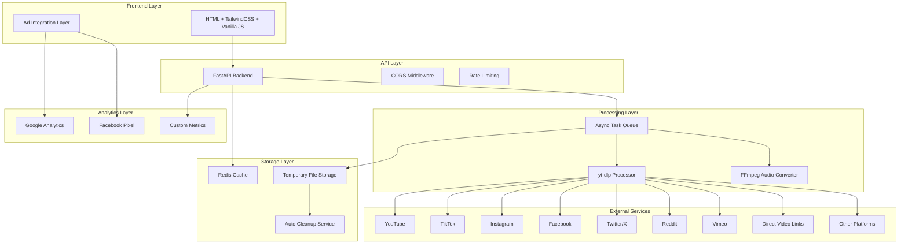
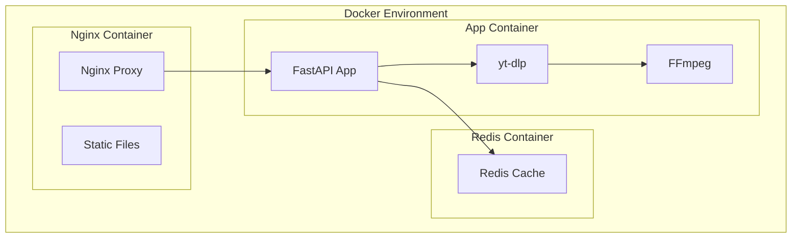

# Design Document

## Overview

VidNet MVP is a high-performance video downloading service built with a modern async architecture. The system uses FastAPI for the backend, yt-dlp for video extraction, Redis for caching, and a clean HTML/TailwindCSS frontend. The architecture prioritizes speed, scalability, and user experience while incorporating revenue generation through strategic ad placement and analytics.

## Architecture

### System Architecture Diagram



### Technology Stack

| Layer | Technology | Purpose |
|-------|------------|---------|
| Frontend | HTML5, TailwindCSS, Vanilla JS | Lightweight, responsive UI |
| Backend | FastAPI (Python 3.12) | Async API with high performance |
| Video Processing | yt-dlp + FFmpeg | Video extraction and audio conversion |
| Caching | Redis (Upstash) | Metadata caching and session management |
| Analytics | Google Analytics 4, Facebook Pixel | User tracking and ad optimization |
| Containerization | Docker + Docker Compose | Local development and deployment |
| Hosting | Render/Railway | Scalable deployment platform |
| CDN | Cloudflare | Static asset delivery and caching |

## Components and Interfaces

### Frontend Components

#### 1. Main Interface Component
```javascript
// Core UI controller
class VidNetUI {
    constructor() {
        this.apiBase = '/api/v1';
        this.currentRequest = null;
    }
    
    async submitURL(url) {
        // Validate URL and fetch metadata
    }
    
    async downloadVideo(url, quality) {
        // Initiate download process
    }
    
    async extractAudio(url, quality) {
        // Extract audio as MP3
    }
}
```

#### 2. Ad Integration Component
```javascript
// Revenue generation through ads
class AdManager {
    constructor() {
        this.gtag = null;
        this.fbq = null;
    }
    
    trackDownload(platform, quality) {
        // Track conversion events
    }
    
    showRewardedAd() {
        // Display rewarded video during processing
    }
}
```

### Backend API Endpoints

#### Core API Structure
```python
# FastAPI application structure
from fastapi import FastAPI, BackgroundTasks
from fastapi.middleware.cors import CORSMiddleware
import asyncio
import redis
import yt_dlp

app = FastAPI(title="VidNet API", version="1.0.0")

# Middleware
app.add_middleware(CORSMiddleware)
app.add_middleware(RateLimitMiddleware)

# Core endpoints
@app.post("/api/v1/metadata")
async def get_video_metadata(url: str)

@app.post("/api/v1/download")
async def download_video(url: str, quality: str, background_tasks: BackgroundTasks)

@app.post("/api/v1/extract-audio")
async def extract_audio(url: str, quality: str, background_tasks: BackgroundTasks)

@app.get("/api/v1/status/{task_id}")
async def get_download_status(task_id: str)
```

### Video Processing Service

#### yt-dlp Integration with Multi-Platform Support
```python
class VideoProcessor:
    def __init__(self):
        self.ydl_opts = {
            'format': 'best[height<=?1080]',
            'outtmpl': 'downloads/%(title)s.%(ext)s',
            'writesubtitles': False,
            'writeautomaticsub': False,
        }
        
        # Platform-specific configurations
        self.platform_configs = {
            'youtube': {'format': 'best[height<=?1080]'},
            'tiktok': {'format': 'best'},
            'instagram': {'format': 'best'},
            'facebook': {'format': 'best'},
            'twitter': {'format': 'best'},
            'reddit': {'format': 'best'},
            'vimeo': {'format': 'best[height<=?1080]'},
            'direct': {'format': 'best'}  # For direct video links
        }
    
    async def detect_platform(self, url: str) -> str:
        # Detect platform from URL pattern
        platform_patterns = {
            'youtube': r'(youtube\.com|youtu\.be)',
            'tiktok': r'tiktok\.com',
            'instagram': r'instagram\.com',
            'facebook': r'facebook\.com',
            'twitter': r'(twitter\.com|x\.com)',
            'reddit': r'reddit\.com',
            'vimeo': r'vimeo\.com',
            'direct': r'\.(mp4|avi|mov|mkv|webm|flv)(\?|$)'
        }
        
    async def extract_metadata(self, url: str) -> dict:
        # Extract video information without downloading
        platform = await self.detect_platform(url)
        opts = self.platform_configs.get(platform, self.ydl_opts)
        
    async def download_video(self, url: str, quality: str) -> str:
        # Download video in specified quality with platform-specific handling
        
    async def extract_audio(self, url: str, quality: str) -> str:
        # Extract and convert audio using FFmpeg
        
    async def handle_direct_link(self, url: str) -> dict:
        # Handle direct video file links (.mp4, .avi, etc.)
        
    async def get_supported_platforms(self) -> list:
        # Return list of all supported platforms
        return ['youtube', 'tiktok', 'instagram', 'facebook', 'twitter', 'reddit', 'vimeo', 'direct_links']
```

### Caching Layer

#### Redis Cache Strategy
```python
class CacheManager:
    def __init__(self):
        self.redis_client = redis.Redis.from_url(REDIS_URL)
        self.metadata_ttl = 3600  # 1 hour
        self.download_ttl = 1800  # 30 minutes
    
    async def get_metadata(self, url: str) -> dict:
        # Check cache first, then fetch if needed
        
    async def cache_metadata(self, url: str, metadata: dict):
        # Store metadata with TTL
        
    async def track_download(self, task_id: str, status: str):
        # Track download progress
```

## Data Models

### Video Metadata Model
```python
from pydantic import BaseModel
from typing import List, Optional

class VideoQuality(BaseModel):
    quality: str  # "720p", "1080p", "4K"
    format: str   # "mp4", "webm"
    filesize: Optional[int]
    fps: Optional[int]

class VideoMetadata(BaseModel):
    title: str
    thumbnail: str
    duration: int
    platform: str  # "youtube", "tiktok", "instagram", "facebook", "twitter", "reddit", "vimeo", "direct"
    available_qualities: List[VideoQuality]
    audio_available: bool
    file_extension: Optional[str]  # For direct links
    original_url: str
    
class DownloadRequest(BaseModel):
    url: str
    quality: str
    format: str  # "video" or "audio"
    
class DownloadResponse(BaseModel):
    task_id: str
    status: str  # "pending", "processing", "completed", "failed"
    download_url: Optional[str]
    error_message: Optional[str]
```

### Analytics Data Model
```python
class AnalyticsEvent(BaseModel):
    event_type: str  # "page_view", "download_start", "download_complete"
    platform: str
    quality: str
    user_agent: str
    timestamp: datetime
    session_id: str
    
class RevenueMetrics(BaseModel):
    ad_impressions: int
    ad_clicks: int
    revenue_per_user: float
    conversion_rate: float
    retention_rate: float
```

## Error Handling

### Error Response Strategy
```python
class VidNetException(Exception):
    def __init__(self, message: str, error_code: str, status_code: int = 400):
        self.message = message
        self.error_code = error_code
        self.status_code = status_code

# Error types
class UnsupportedPlatformError(VidNetException):
    pass

class VideoNotFoundError(VidNetException):
    pass

class QualityNotAvailableError(VidNetException):
    pass

class ProcessingTimeoutError(VidNetException):
    pass

# Error handler middleware
@app.exception_handler(VidNetException)
async def vidnet_exception_handler(request: Request, exc: VidNetException):
    return JSONResponse(
        status_code=exc.status_code,
        content={
            "error": exc.error_code,
            "message": exc.message,
            "suggestion": get_error_suggestion(exc.error_code)
        }
    )
```

### Retry and Fallback Logic
```python
class RetryManager:
    def __init__(self):
        self.max_retries = 3
        self.backoff_factor = 2
    
    async def retry_with_backoff(self, func, *args, **kwargs):
        for attempt in range(self.max_retries):
            try:
                return await func(*args, **kwargs)
            except Exception as e:
                if attempt == self.max_retries - 1:
                    raise
                await asyncio.sleep(self.backoff_factor ** attempt)
```

## Testing Strategy

### Unit Testing
- **FastAPI endpoints**: Test all API endpoints with various inputs
- **Video processing**: Mock yt-dlp responses and test extraction logic
- **Caching layer**: Test Redis operations and TTL behavior
- **Error handling**: Test all error scenarios and response formats

### Integration Testing
- **End-to-end workflows**: Test complete download processes
- **Platform compatibility**: Test with real URLs from each platform (YouTube, TikTok, Instagram, Facebook, Twitter/X, Reddit, Vimeo, direct video links)
- **Performance testing**: Load test with concurrent requests
- **Cache effectiveness**: Test cache hit rates and performance gains

### Performance Testing
```python
# Load testing configuration
CONCURRENT_USERS = 100
TEST_DURATION = 300  # 5 minutes
TARGET_RESPONSE_TIME = 3000  # 3 seconds

# Key metrics to monitor
- Metadata fetch time: < 200ms
- Download preparation: < 3 seconds
- Concurrent request handling: 100+ users
- Cache hit rate: > 80%
- Error rate: < 1%
```

### Monitoring and Analytics
```python
# Custom metrics collection
class MetricsCollector:
    def __init__(self):
        self.metrics = {
            'downloads_total': 0,
            'downloads_by_platform': {},
            'downloads_by_quality': {},
            'average_processing_time': 0,
            'cache_hit_rate': 0,
            'error_rate': 0
        }
    
    def track_download(self, platform: str, quality: str, processing_time: float):
        # Update metrics
        
    def track_error(self, error_type: str):
        # Track error occurrences
        
    def get_dashboard_data(self) -> dict:
        # Return metrics for admin dashboard
```

## Docker Configuration

### Development Environment Setup

The application uses Docker for consistent local development and easy dependency management, especially for FFmpeg and system-level requirements.

#### Docker Architecture


#### Dockerfile Configuration
```dockerfile
# Multi-stage build for optimized production image
FROM python:3.12-slim as builder

# Install system dependencies
RUN apt-get update && apt-get install -y \
    ffmpeg \
    wget \
    curl \
    && rm -rf /var/lib/apt/lists/*

# Install Python dependencies
COPY requirements.txt .
RUN pip install --no-cache-dir -r requirements.txt

FROM python:3.12-slim as production

# Copy system dependencies
RUN apt-get update && apt-get install -y \
    ffmpeg \
    && rm -rf /var/lib/apt/lists/*

# Copy Python environment
COPY --from=builder /usr/local/lib/python3.12/site-packages /usr/local/lib/python3.12/site-packages
COPY --from=builder /usr/local/bin /usr/local/bin

# Application setup
WORKDIR /app
COPY . .

# Create non-root user for security
RUN useradd --create-home --shell /bin/bash vidnet
RUN chown -R vidnet:vidnet /app
USER vidnet

# Health check
HEALTHCHECK --interval=30s --timeout=10s --start-period=5s --retries=3 \
    CMD curl -f http://localhost:8000/health || exit 1

EXPOSE 8000
CMD ["uvicorn", "main:app", "--host", "0.0.0.0", "--port", "8000"]
```

#### Docker Compose Configuration
```yaml
version: '3.8'

services:
  app:
    build: .
    ports:
      - "8000:8000"
    environment:
      - REDIS_URL=redis://redis:6379
      - ENVIRONMENT=development
    volumes:
      - ./downloads:/app/downloads
      - ./logs:/app/logs
    depends_on:
      - redis
    restart: unless-stopped

  redis:
    image: redis:7-alpine
    ports:
      - "6379:6379"
    volumes:
      - redis_data:/data
    restart: unless-stopped
    command: redis-server --appendonly yes

  nginx:
    image: nginx:alpine
    ports:
      - "80:80"
    volumes:
      - ./nginx.conf:/etc/nginx/nginx.conf
      - ./static:/usr/share/nginx/html
    depends_on:
      - app
    restart: unless-stopped

volumes:
  redis_data:
```

#### Development vs Production Configurations

**Development (docker-compose.dev.yml)**
```yaml
version: '3.8'

services:
  app:
    build:
      context: .
      target: builder  # Use builder stage for faster rebuilds
    volumes:
      - .:/app  # Live code reloading
      - /app/__pycache__  # Exclude cache
    environment:
      - DEBUG=true
      - RELOAD=true
    command: uvicorn main:app --host 0.0.0.0 --port 8000 --reload

  redis:
    image: redis:7-alpine
    ports:
      - "6379:6379"
```

**Production (docker-compose.prod.yml)**
```yaml
version: '3.8'

services:
  app:
    build:
      context: .
      target: production
    environment:
      - ENVIRONMENT=production
      - WORKERS=4
    deploy:
      replicas: 2
      resources:
        limits:
          memory: 1G
        reservations:
          memory: 512M
```

This design provides a solid foundation for the VidNet MVP with clear separation of concerns, scalable architecture, Docker containerization for reliable development, and built-in revenue generation capabilities while maintaining the fast, clean user experience you envisioned.