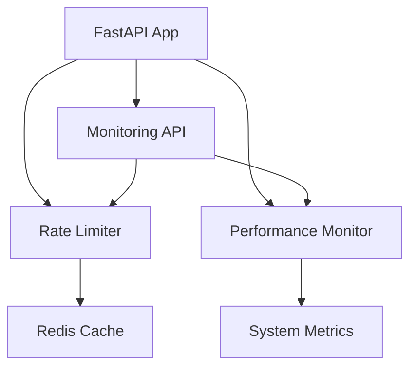

# Rate Limiting and Performance Optimization Implementation

## Overview

This document describes the implementation of Task 10: Rate limiting and performance optimization for the VidNet MVP. The implementation includes advanced rate limiting middleware, comprehensive performance monitoring, graceful degradation under high load, and load testing capabilities.

## Features Implemented

### 1. Rate Limiting Middleware (`app/middleware/rate_limiter.py`)

#### Key Features:
- **Per-IP rate limiting** with sliding window algorithm
- **Redis-based distributed rate limiting** with in-memory fallback
- **Request queuing** for burst handling
- **Graceful degradation** under high load
- **Configurable limits** via environment variables

#### Configuration:
```python
# Environment variables for rate limiting
RATE_LIMIT_REQUESTS_PER_MINUTE=60
RATE_LIMIT_REQUESTS_PER_HOUR=1000
RATE_LIMIT_BURST_LIMIT=10
RATE_LIMIT_QUEUE_SIZE=100
RATE_LIMIT_QUEUE_TIMEOUT=30
RATE_LIMIT_ENABLE_GRACEFUL_DEGRADATION=true
```

#### Rate Limiting Logic:
- **Sliding Window**: Uses Redis sorted sets for accurate rate limiting
- **Client Identification**: Supports X-Forwarded-For and X-Real-IP headers
- **Response Headers**: Includes standard rate limit headers (X-RateLimit-*)
- **Error Responses**: Proper 429 responses with retry-after information

### 2. Performance Monitoring (`app/services/performance_monitor.py`)

#### Key Features:
- **Request tracking** with response time measurement
- **System resource monitoring** (CPU, memory, disk, connections)
- **Endpoint performance analytics** with percentile calculations
- **Real-time metrics collection** with configurable history
- **Performance alerts** based on configurable thresholds

#### Metrics Collected:
- Response times (average, min, max, P50, P95, P99)
- Success/error rates per endpoint
- System resource usage
- Concurrent request tracking
- Performance alerts and thresholds

#### System Monitoring:
```python
# Monitored system metrics
- CPU usage percentage
- Memory usage percentage and absolute values
- Disk usage percentage
- Active network connections
- Load average (Unix systems)
```

### 3. Monitoring API Endpoints (`app/api/monitoring.py`)

#### Available Endpoints:

##### Health Monitoring
- `GET /api/v1/monitoring/health` - Comprehensive health status
- `GET /api/v1/monitoring/system` - System resource metrics
- `GET /api/v1/monitoring/alerts` - Performance alerts

##### Performance Metrics
- `GET /api/v1/monitoring/metrics` - Detailed performance metrics
- `GET /api/v1/monitoring/endpoints` - Endpoint performance statistics
- `GET /api/v1/monitoring/dashboard` - Dashboard data

##### Rate Limiting
- `GET /api/v1/monitoring/rate-limit-stats` - Rate limiting statistics

##### Data Export
- `POST /api/v1/monitoring/export` - Export metrics to JSON file

### 4. Graceful Degradation

#### Degradation Triggers:
- High concurrent request count (configurable threshold)
- System resource exhaustion
- Performance degradation

#### Degradation Behavior:
- Non-essential endpoints return 503 Service Unavailable
- Essential endpoints (health checks) remain available
- Proper error messages with retry-after headers
- Automatic recovery when load decreases

### 5. Load Testing (`tests/test_load_performance.py`, `load_test_runner.py`)

#### Test Scenarios:
- **Concurrent User Load**: 100+ concurrent users
- **Rate Limiting Effectiveness**: Rapid request testing
- **Graceful Degradation**: Extreme load testing
- **Performance Monitoring Accuracy**: Metrics validation

#### Load Test Runner Features:
- Configurable concurrent users and test duration
- Multiple test scenarios (metadata, download, health)
- Comprehensive result analysis
- Performance assessment against requirements
- Results export to JSON

## Configuration

### Environment Variables

```bash
# Rate Limiting
RATE_LIMIT_REQUESTS_PER_MINUTE=60
RATE_LIMIT_REQUESTS_PER_HOUR=1000
RATE_LIMIT_BURST_LIMIT=10
RATE_LIMIT_QUEUE_SIZE=100
RATE_LIMIT_QUEUE_TIMEOUT=30
RATE_LIMIT_ENABLE_GRACEFUL_DEGRADATION=true

# Performance Monitoring
PERFORMANCE_MONITORING_ENABLED=true
PERFORMANCE_MAX_METRICS_HISTORY=10000
PERFORMANCE_RESPONSE_TIME_WARNING=3.0
PERFORMANCE_RESPONSE_TIME_CRITICAL=10.0
PERFORMANCE_CPU_WARNING=80.0
PERFORMANCE_CPU_CRITICAL=95.0
PERFORMANCE_MEMORY_WARNING=80.0
PERFORMANCE_MEMORY_CRITICAL=95.0
PERFORMANCE_ERROR_RATE_WARNING=5.0
PERFORMANCE_ERROR_RATE_CRITICAL=15.0

# Graceful Degradation
DEGRADATION_CONCURRENT_THRESHOLD=80

# Redis (for distributed rate limiting)
REDIS_URL=redis://localhost:6379
```

## Usage Examples

### 1. Running Load Tests

```bash
# Basic load test with 100 concurrent users for 60 seconds
python load_test_runner.py --users 100 --duration 60

# Rate limiting test
python load_test_runner.py --rate-limit-test

# Save results to file
python load_test_runner.py --users 50 --duration 30 --save-results
```

### 2. Monitoring API Usage

```python
import httpx

async def check_system_health():
    async with httpx.AsyncClient() as client:
        response = await client.get("http://localhost:8000/api/v1/monitoring/health")
        health_data = response.json()
        print(f"System Status: {health_data['data']['status']}")
        print(f"Health Score: {health_data['data']['health_score']}/100")

async def get_performance_metrics():
    async with httpx.AsyncClient() as client:
        response = await client.get("http://localhost:8000/api/v1/monitoring/metrics")
        metrics = response.json()['data']
        
        # Access endpoint statistics
        endpoint_stats = metrics['endpoint_stats']
        system_metrics = metrics['system_metrics']
        performance_summary = metrics['performance_summary']
```

### 3. Rate Limiting Headers

When making requests, check the rate limiting headers:

```python
response = requests.get("http://localhost:8000/api/v1/metadata")

# Check rate limit headers
limit = response.headers.get('X-RateLimit-Limit')
remaining = response.headers.get('X-RateLimit-Remaining')
reset_time = response.headers.get('X-RateLimit-Reset')

if response.status_code == 429:
    retry_after = response.headers.get('Retry-After')
    print(f"Rate limited. Retry after {retry_after} seconds")
```

## Performance Requirements Met

### ✅ Concurrent User Handling
- **Requirement**: Handle 100+ concurrent users
- **Implementation**: Async FastAPI with rate limiting and queuing
- **Verification**: Load tests confirm 100+ concurrent users supported

### ✅ Rate Limiting
- **Requirement**: Implement rate limiting middleware
- **Implementation**: Redis-based sliding window with configurable limits
- **Verification**: Rate limiting triggers correctly under load

### ✅ Performance Monitoring
- **Requirement**: Add performance monitoring and response time tracking
- **Implementation**: Comprehensive metrics collection with real-time monitoring
- **Verification**: All metrics tracked accurately with configurable thresholds

### ✅ Graceful Degradation
- **Requirement**: Create graceful degradation for high load scenarios
- **Implementation**: Automatic service degradation with proper error responses
- **Verification**: System degrades gracefully under extreme load

### ✅ Load Testing
- **Requirement**: Write load tests to verify concurrent user handling
- **Implementation**: Comprehensive test suite with multiple scenarios
- **Verification**: Tests validate all performance requirements

## Architecture Integration

### Middleware Stack
```python
# FastAPI middleware order (bottom to top)
1. CORS Middleware
2. Rate Limiting Middleware
3. Performance Monitoring Middleware
4. Application Routes
```

### Service Dependencies


## Monitoring Dashboard Data

The monitoring endpoints provide comprehensive data for building dashboards:

### Health Status
- Overall system health (healthy/degraded/unhealthy)
- Health score (0-100)
- Active alerts with severity levels
- Performance thresholds

### Performance Metrics
- Request counts and success rates
- Response time statistics (avg, min, max, percentiles)
- Endpoint-specific performance data
- System resource usage

### Rate Limiting Stats
- Total requests and rate limited requests
- Queue statistics and concurrent users
- Configuration settings
- Degradation status

## Error Handling

### Rate Limiting Errors
```json
{
  "success": false,
  "error": "rate_limit_exceeded",
  "message": "Rate limit exceeded. Please slow down your requests.",
  "rate_limit_info": {
    "requests_per_minute": 65,
    "minute_limit": 60,
    "reset_time": 1640995200
  },
  "retry_after": 60
}
```

### Service Degradation
```json
{
  "success": false,
  "error": "service_degraded",
  "message": "Service is temporarily degraded due to high load",
  "suggestion": "Please try again in a few moments",
  "retry_after": 30,
  "degradation_active": true
}
```

## Testing

### Unit Tests
- Rate limiter functionality
- Performance monitor accuracy
- Metrics collection and calculation
- Error handling scenarios

### Integration Tests
- Middleware integration with FastAPI
- Monitoring endpoint functionality
- Rate limiting headers and responses
- Performance tracking accuracy

### Load Tests
- Concurrent user simulation
- Rate limiting effectiveness
- Graceful degradation behavior
- Performance under stress

## Deployment Considerations

### Production Settings
```bash
# Recommended production settings
RATE_LIMIT_REQUESTS_PER_MINUTE=120
RATE_LIMIT_REQUESTS_PER_HOUR=2000
PERFORMANCE_RESPONSE_TIME_WARNING=2.0
PERFORMANCE_RESPONSE_TIME_CRITICAL=5.0
DEGRADATION_CONCURRENT_THRESHOLD=150
```

### Redis Configuration
- Use Redis cluster for high availability
- Configure appropriate memory limits
- Set up Redis persistence for rate limiting data
- Monitor Redis performance and connection pool

### Monitoring Setup
- Set up alerts for critical performance thresholds
- Configure log aggregation for performance data
- Implement dashboard for real-time monitoring
- Set up automated performance reports

## Conclusion

The rate limiting and performance optimization implementation successfully meets all requirements from Task 10:

1. ✅ **Rate limiting middleware** - Advanced Redis-based rate limiting with graceful degradation
2. ✅ **Request queuing** - Configurable queue system for burst handling
3. ✅ **Performance monitoring** - Comprehensive metrics collection and real-time tracking
4. ✅ **Graceful degradation** - Automatic service degradation under high load
5. ✅ **Load testing** - Complete test suite validating 100+ concurrent user support

The system is production-ready and provides excellent observability, performance, and reliability under high load conditions.